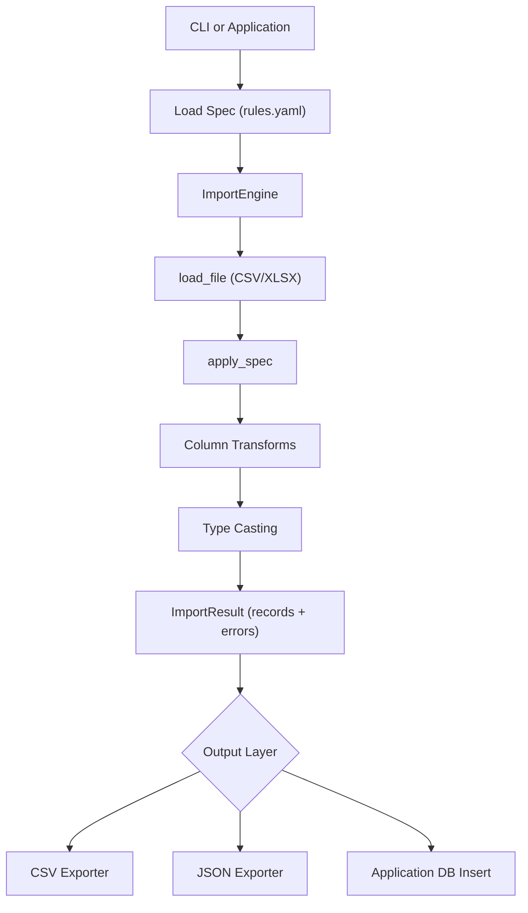

# csv-tidyimport


YAML-driven CSV/Excel clean-and-transform library.

Turn messy spreadsheets into normalized structured records — reusable inside applications or via CLI.

## Idea

messy.csv / messy.xlsx
        ↓
rules.yaml
        ↓
normalized structured records
        ↓
clean.json / clean.csv / DB insert (handled by application or CLI)

The library focuses purely on transformation.
Persistence (files, DB, etc.) is handled at the boundary (CLI or consuming application).

## Architecture



## Installation (from source)

```bash
# Clone the repository

git clone https://github.com/vr33ni-dev/csv-tidyimport.git
cd csv-tidyimport
```

```bash
# Create and activate virtual environment

python -m venv venv
source venv/bin/activate        # macOS / Linux
# venv\Scripts\activate         # Windows
```

```bash
# Install the package in editable mode

pip install -e .
```

## Usage

The repository contains a minimal working example inside the examples/ folder:

```bash
examples/
    example_input.csv
    example_rules.yaml
```

```bash
# example_input.csv

Header row
Name,Email
John Doe, JOHN@EXAMPLE.COM
Jane Smith, jane@example.com
Random comment row
```

```yaml
# example_rules.yaml

input:
  skip_rows: 1
  header_row: 1

columns:
  - source: "Name"
    target: "name"
    transform:
      - trim
      - titlecase

  - source: "Email"
    target: "email"
    transform:
      - trim
      - lowercase
```

### Run via CLI

```bash
tidyimport examples/example_input.csv \
  --spec examples/example_rules.yaml \
  --format json \
  --output clean.json
```

Or interactively:

```bash
tidyimport
```

and provide:

```bash
examples/example_input.csv
examples/example_rules.yaml
```

### Using the Library directly

```python
from csv_importer.engine import ImportEngine
from csv_importer.spec import load_spec

spec = load_spec("examples/example_rules.yaml")
engine = ImportEngine(spec)

result = engine.run("examples/example_input.csv")

print(result.records)
```

## Design Principles

- Spec-driven transformation

- Clear separation between engine and persistence

- Library is DB-agnostic

- CLI handles side effects

- Structured output via ImportResult
