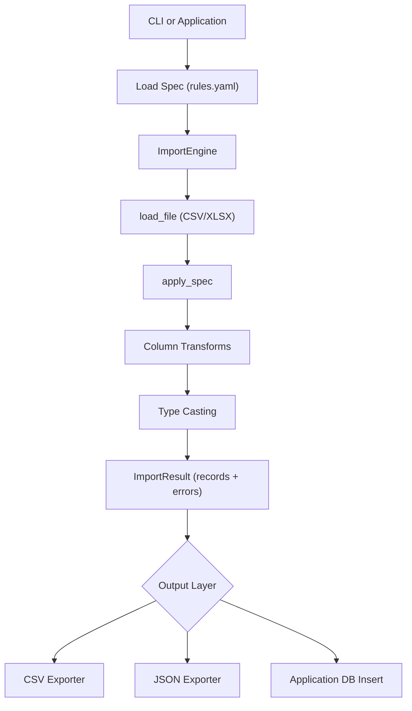

# csv-tidyimport

YAML-driven CSV/Excel clean-and-transform library

## Idea

messy.csv / messy.xlsx
        ↓
rules.yaml
        ↓
normalized structured records
        ↓
clean.json / clean.csv / DB insert (handled by application or CLI)

## Architecture

